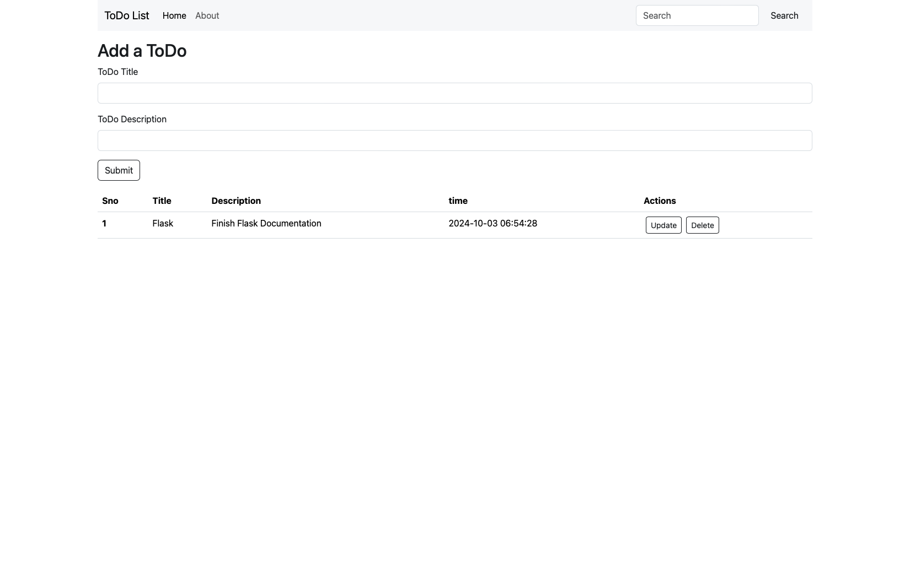
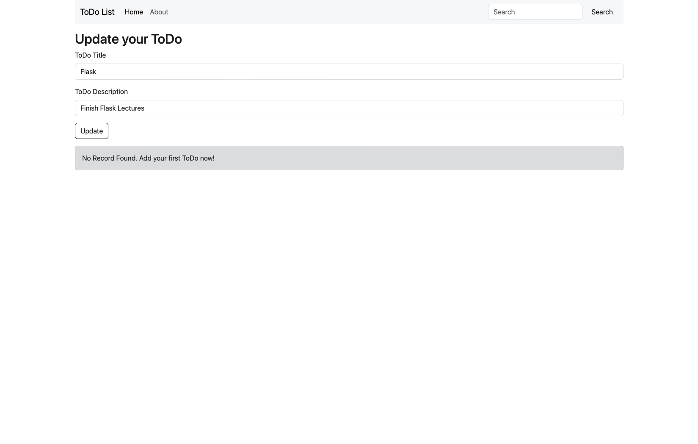

# Flask ToDo Application

This is a simple Flask-based ToDo web application that allows users to create, update, and delete tasks. The tasks are stored in a MySQL database.

## Project Overview

This project demonstrates basic CRUD (Create, Read, Update, Delete) operations using Flask, SQLAlchemy, and MySQL. The web interface uses Bootstrap to make it responsive and visually appealing.

### Features

- Add new ToDo items
- Update existing ToDo items
- Delete ToDo items
- View all ToDo items

## Prerequisites

Before running this project, ensure you have the following installed:

- Python 3.x: [Download here](https://www.python.org/downloads/)
- MySQL: [Download here](https://dev.mysql.com/downloads/installer/)
- Flask: Installed via `pip` (instructions below)
- Git: For version control (optional but recommended)

## Project Structure

project-folder/
│
├── app.py              # Main Flask application
├── requirements.txt    # List of dependencies
├── templates/          # HTML templates for rendering pages
│   ├── base.html       # Base template for reuse
│   ├── index.html      # Homepage template
│   └── update.html     # Update ToDo template
├── static/             # Static files (CSS, JS)
└── .gitignore          # Ignored files for Git

Installation and Setup

Follow these steps to run the project locally:

1. Clone the Repository

    Clone the repository from GitHub:
        git clone https://github.com/your-username/repository-name.git
        cd repository-name

2. Set Up the Database

	•	Make sure MySQL is installed and running.

	•	Create a new database for the project:
            CREATE DATABASE ToDo;

	•	Open app.py and modify the database connection string to match your MySQL credentials:
            app.config['SQLALCHEMY_DATABASE_URI'] = "mysql+pymysql://<username>:<password>@localhost/ToDo"

3. Install Dependencies

    •   Install the required Python packages using pip:
            pip install -r requirements.txt

4. Run the Application

    •   Run the Flask app using:
            python app.py
        
        The application will start on http://127.0.0.1:1000/.

5. Interact with the ToDo App

    •   You can now add, update, and delete ToDo items directly through the web interface.

How to Use

	1.	Add a Task: Fill in the “ToDo Title” and “ToDo Description” and click “Submit”.
	2.	View Tasks: All ToDo items will be listed in a table.
	3.	Update a Task: Click the “Update” button next to a task to modify it.
	4.	Delete a Task: Click the “Delete” button to remove a task.

Technologies Used

	•	Flask: A lightweight web framework for Python.
	•	SQLAlchemy: An ORM library for working with databases.
	•	MySQL: The database for storing ToDo items.
	•	Bootstrap: A CSS framework for building responsive web pages.

## Screenshots

### Home Page

### Update ToDo

### Author

[Nikhil Kumar](https://github.com/sawarn-nik)
